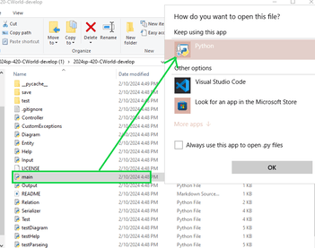

# 2024sp-420-CWorld

This readme contains the steps to launch the **CWorld UML Editor**. This is a terminal based program that allows users to create a Class Diagram with Relations, Classes, and Attributes. Once the program is running, type 'help' for a list of commands.

# Steps for Running the Program


## Prerequisite 
You can check if you have python installed by entering ```py -V``` or ```python3 --version``` into terminal


If you don't have python installed (tested on 3.12.2)[ follow the steps here!](https://www.python.org/downloads/)


## Step 1 Download Zip

[Download Zip here!](https://github.com/mucsci-students/2024sp-420-CWorld/archive/refs/heads/main.zip)


## Step 2 Extract and Locate

Windows OS:

- Locate downloaded Zip file
- Right click and select extract
- Select "Show extracted files"
- Select extract
- Select the ```2024sp-420-CWorld-develop``` folder
- Double click the ```main``` file and open with Python



MacOS:

- Locate downloaded Zip file
- Double click the downloaded Zip file to extract
- Open the extracted folder ```2024sp-420-CWorld-develop``` from the extraction location (same location as your downloaded Zip file)
- Right click on `main.py and open with Python Launcher

## Step 3 Use the Program
Enter ```help``` within the terminal for a list of commands


## Authors
Adam Glick-Lynch, Ganga Acharya, Marshall Feng, Peter Freedman, Tim Moser
